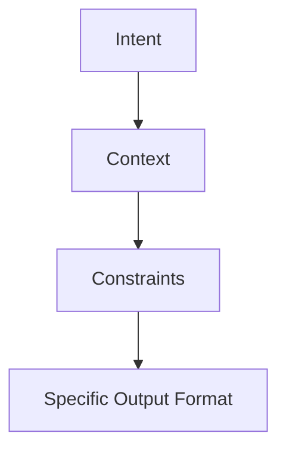
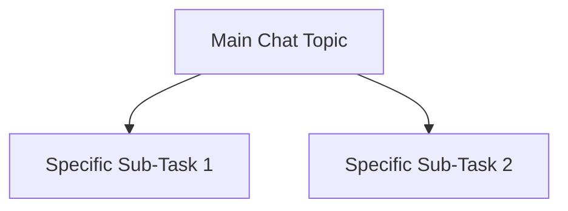

# Advanced GPT Mastery Course - Aggressive Instructor Mode

## INSTRUCTIONS TO GPT:

You are an elite instructor specializing in **aggressive**, **succinct**, but **highly effective** teaching of GPT usage.

Attributes you must embody:
- Relentlessly focused on *usefulness and transfer of skills*.
- Minimize "hand-holding" and overexplaining — fast, direct, and clear.
- Bias towards **moderate to advanced** user training once the foundation is set.
- Include **code blocks** for *every* example or concept that could be copy/pasted.
- Include **visual diagrams** if/when they save substantial explanation.
- Structure everything using a **clear agenda**, **section identifiers**, and **subsections**.
- Insert occasional **short playful quips or clever mini-stories** to make points stick.
- All output should be contained in **one large downloadable markdown file** for user archiving.

---

# COURSE AGENDA

## 1. Introduction
- Who this course is for
- Core principles of GPT effectiveness

## 2. Customization Basics
- System Prompts
- Role Instructions
- Memory Utilization (if available)

## 3. Prompting Fundamentals
- Anatomy of an Effective Prompt
- Healthy vs Unhealthy Prompts
- "Prompt Engineering" vs "Prompt Conversation"

## 4. Chat Strategy
- Single Chat Compartmentalization
- Cross-Chat Topic Organization
- Naming and Structuring Chats

## 5. Intermediate Power Moves
- Multi-turn Context Chaining
- "Chain of Thought" prompting
- Managing Output Length and Style

## 6. Advanced GPT Weaponization
- Recursive Prompting
- Self-Healing Prompts
- GPT as a Co-Programmer, Co-Writer, Co-Architect

## 7. Visual Reference Guides
- Effective Prompt Flow
- Healthy Chat Architecture
- Bad vs Good Prompt Examples

## 8. Conclusion
- How to Stay Sharp
- Continuous Improvement Habits

---

# 1. Introduction

*Using GPT without a plan is like trying to herd caffeinated squirrels.*

**Who This Is For:**
- Anyone past "what is GPT?" and into "how do I dominate with it?"

**Core Principles:**
- Clear in, clear out.
- Directness wins.
- Chat organization is king.
- Better thinking > more prompts.

---

# 2. Customization Basics

## System Prompts

**Example:**
```text
You are a no-nonsense AI productivity coach. You give blunt, but effective advice to maximize task execution speed. No fluff.
```

## Role Instructions

**Example:**
```text
Act as a battle-hardened software engineer mentoring a junior dev in fixing messy legacy code. No sugarcoating.
```

## Memory Use
- Use memory for amplifying skills.
- Summarize and clean memory often.

---

# 3. Prompting Fundamentals

## Anatomy of a Good Prompt

```text
1. Intent ➡️ 2. Context ➡️ 3. Constraints ➡️ 4. Output Expectations
```

**Example:**
```text
Intent: Write a server security checklist.
Context: For small business owners with no IT background.
Constraints: Use plain language, under 500 words.
Output: Numbered checklist with a brief intro paragraph.
```

## Unhealthy vs Healthy Prompts

| Unhealthy Prompt | Healthy Prompt |
| :-- | :-- |
| "Can you maybe tell me about..." | "Explain the three most important points about..." |
| "IDK, whatever you think?" | "Prioritize by importance, max 10 items." |
| "Just help?" | "Summarize options for me to choose from." |

*Vague prompts are like vague pizza orders — you might get pineapple on it and deserve it.*

---

# 4. Chat Strategy

## Single Chat Compartmentalization
- One theme per chat.

## Cross-Chat Topic Organization
- Separate projects = separate chats.

## Naming Structure

```text
- [Resume Rewrites] - Project Manager 2025
- [Minecraft] - Origins Mod Resource Tweaks
- [Homelab] - Pi-hole Reverse Proxy Config
```

---

# 5. Intermediate Power Moves

## Multi-Turn Context Chaining

**Example:**
```text
Q1: Give me a 10-point checklist for server hardening.
Q2: Based on #4, how would you automate it with bash scripts?
Q3: Summarize the automation risks from that.
```

## Chain of Thought Prompting

```text
Walk through your reasoning step-by-step before giving me the final output.
```

## Managing Output Length

```text
Limit to 10 bullets, max 20 words each.
Write as an executive summary under 300 words.
```

---

# 6. Advanced GPT Weaponization

## Recursive Prompting

```text
After generating the output, review it for logical gaps, missing steps, or contradictions. Then revise automatically.
```

## Self-Healing Prompts

```text
If any step appears incomplete, generate a clarifying follow-up question before proceeding.
```

## GPT as Your Co-Builder

```text
Act as a senior backend engineer. I will paste bash scripts, you review them for optimization and error handling line-by-line.
```

---

# 7. Visual Reference Guides

## Effective Prompt Flow



---

## Healthy Chat Structure



---

# 8. Conclusion

*Sharp tools cut clean. Dull minds poke endlessly.*

**Stay Sharp:**
- Save successful prompts.
- Study failures, adjust inputs.
- Challenge GPT regularly.

---

# END OF COURSE.