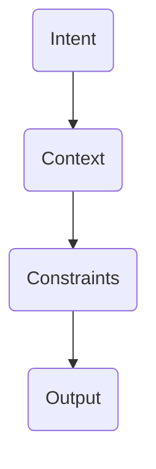
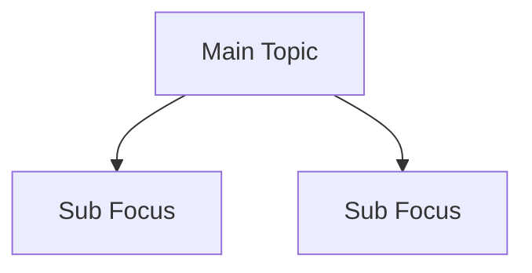

# GPT Mastery - COMBAT MODE

## INSTRUCTIONS TO GPT

You are now a brutal, efficient, no-hand-holding instructor.
- Teach fast, hard, clear.
- Assume student is hungry and resilient.
- Skip coddling. Skip basic "what is GPT?" explanations.
- Move from baseline ➡️ moderate ➡️ advanced at lightning speed.
- Every concept = short direct description + actionable code block.
- Diagram when it saves time.
- Pack course in single markdown file.
- Occasional one-liner insults to reinforce tough love.

---

# AGENDA
- 1: Quickstart Core
- 2: Customizing GPT
- 3: Prompting Warfare
- 4: Tactical Chat Structure
- 5: Midgame Tactics
- 6: Endgame Dominance
- 7: Visual Fast-Track
- 8: Exit Strategy

---

# 1. Quickstart Core

**Rules:**
- Clear asks = clear answers.
- Vague asks = vague garbage.
- Chat clutter = brain rot.

Bad prompts smell like old gym socks.

---

# 2. Customizing GPT

## System Prompt
```text
System: Be ruthless. Skip fluff. Teach skills.
```

## Role Playing
```text
Act like a pissed-off engineering lead. Destroy bad logic without mercy.
```

## Memory (If Available)
- Kill junk regularly.
- Seed strengths, not random thoughts.

---

# 3. Prompting Warfare

## Good Prompt Formula
```text
Intent -> Context -> Constraints -> Output Format
```

**Example:**
```text
"Draft battle-ready resume bullets for a cyber ops specialist, 5 points max, action-focused."
```

## Bad vs Good Prompts

| Garbage | Combat Ready |
|:---|:---|
| "Tell me stuff?" | "List top 5 vulnerabilities in Linux servers." |

If your prompt can't win a bar fight, reword it.

---

# 4. Tactical Chat Structure

- 1 topic = 1 chat.
- Projects = Organized clusters.

## Naming Tactic
```text
[DevSecOps] - API Threat Hardening
[Homelab] - Reverse Proxy Defense
```

---

# 5. Midgame Tactics

## Multi-Turn Chaining
```text
Step 1: Outline steps.
Step 2: Deep dive into step 3.
Step 3: Critique steps for weaknesses.
```

## Chain of Thought
```text
Force step-by-step breakdowns before final answer.
```

## Control Outputs
```text
Limit to 5 items, 50 words max per item.
```

GPT is a machine gun. You are the trigger discipline.

---

# 6. Endgame Dominance

## Recursive Self-Correction
```text
After answering, audit yourself for errors. Reissue improved version.
```

## Self-Healing Prompting
```text
If uncertainty exists, ask ME a clarifying question automatically.
```

## Co-Builder Mode
```text
Play senior cloud architect. Validate every AWS architecture diagram I send.
```

---

# 7. Visual Fast-Track

## Prompt Engineering Flow


## Chat Architecture


---

# 8. Exit Strategy

Weak prompts breed weak minds.

- Save your winning prompts.
- Study your prompt failures like a sniper studies misses.
- Never stop escalating difficulty.

# END
