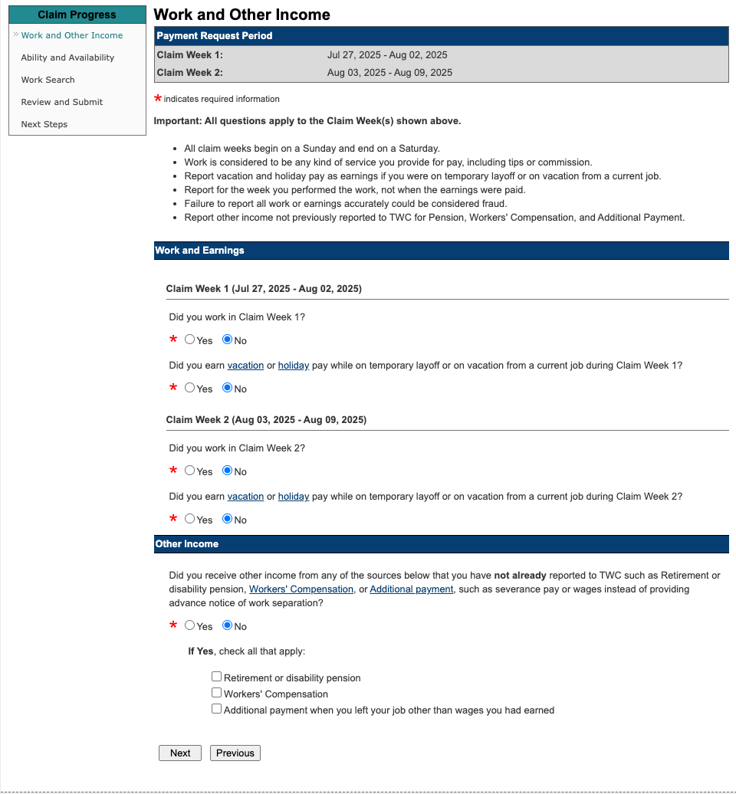

# Texas Workforce Commission (TWC) 2025 Unemployment Information

TWC Application Confirmation No.: 0605SYS9251  

ℹ **Unemployment Payments == July 27 2025 - January 17 2026**
	- 💰Submit Payment Requests Every Tuesday, starting Aug 12 2025

Claim Information Summary
	Claim Type: Regular Unemployment Benefits
	Weekly Benefit Amount: $591.00
	Maximum Possible Benefits: $15,366.00
	Your Scheduled Filing Day is : TUESDAY
	File on your scheduled filing day or Thursday through Saturday

job search activity (adhoc) requests : my log must be converted to twc's form when asked `2025-06-06-twc-work-search-activity-log.pdf` in `unemployment-2025` folder

*Recurring Tasks*
- daily : log any adhoc job search activity in [local file store]()
- daily
- *weekly : log 3+ work search activities*
- *bi-weekly : request payment covering previous 2 weeks*
- *upon request: submit job search log, only if twc asks (use their form!)* 

---
## Resources

[TWC Unemployment Benefits Glossary of Terms](https://apps.twc.texas.gov/UBS/glossary.do)
[Texas Unemployment Benefits Site](https://apps.twc.texas.gov/UBS/security/logon.do)  
[WorkInTexas.com](https://www.workintexas.com/vosnet/Registration/Ind/QuickRegistration.aspx?enc=eXBo6xLtkQ4kIRux3bTIoi0rf4XF1oVgO480WUg4UAQ=) *required only when chasing employment in TX
[TX work search requirements](https://www.twc.texas.gov/programs/unemployment-benefits/work-search-requirements)

[Northern Middle TN Job Board](https://nm-wb.com/jobseekers)
[jobs4TN - TN Dept of Labor](https://jobs4tnwfs.tn.gov/vosnet/default.aspx)


'interstate claim' = where an individual worked for the full duration of employment and was laid off while living in one state but now lives in another.  

****Phone Numbers:**
- tele-center (customer service): 800-939-6631
- tele-serv (automated): 800-558-8321
- benefit overpayment collections: 512-936-3338**

---
## Eligibility Info

**⚠️ IMPORTANT: Wait Until Severance Ends to Collect Unemployment!**
> Because your severance is being paid out as bi-weekly checks, the Texas Workforce Commission (TWC) treats that period as continued employment/pay, even if you’re not working.

🔍 Breakdown:  
- Your 20-week severance delays your unemployment for 20 weeks from March 3, 2025
  - *That pushes your first eligible claim week to around July 21, 2025*
- TWC will disqualify benefit payments during weeks you’re receiving severance in check form
  - *This is true even if you file and certify — they’ll just mark you ineligible for payment*

---

✅ What You Should Do Now:

Action	When
- File claim (✅ done): June 6, 2025
- Start tracking work search: Week of July 21 (first eligible week)
- First payment request date: Tuesday, August 5, 2025 (covering July 21–Aug 3)

Track final severance paycheck :: Due week of July 14
Begin tracking job searches :: Starting week of July 21
File first payment request :: Tuesday, August 5

✅ **You log job search activities weekly** (minimum **3 per week**)
✅ **You submit your payment request every 2 weeks**

---

🧠 Activity Behaviour

| **Action**            | **Frequency**        |
| --------------------- | -------------------- |
| Track job searches    | **Weekly** (min 3)   |
| Request payment       | **Every 2 weeks**    |
| Submit job search log | **Only if TWC asks** |
_“Think of it like taxes — record everything, submit just enough.”_

💡 Pro Tip:
	•	You can and should continue certifying every 2 weeks, even if benefits are $0, to stay active in the system
	•	Once severance ends, payments should auto-begin, assuming eligibility and no other red flags

8005588321

---

## Key Requirements

[TWC Work Search Requirements](https://www.twc.texas.gov/programs/unemployment-benefits/work-search-requirements)

✅ One-Time Actions (Initial Setup)
- [x] Apply for Unemployment Benefits
- [x] Register for Work within 3 business days of applying 
  - [x] register in Texas
  - [x] register in TN via [[Jobs4TN]]
  - [x] Out-of-state? Register at a local workforce office in your state (www.servicelocator.org)
- [x] Print or save confirmation page after filing
- [x] Wait two business days before checking claim status
- [x] Read the unemployment benefits packet (call if not received within 7 business days)
- Notify TWC when you return to full-time work to get your “waiting week” payment
  - Can do this online or by calling Tele-Serv or a Tele-Center
- [x] Set up payment method (direct deposit or debit card)

---

🔁 Recurring Actions (Ongoing Requirements)
- Request payment every 2 weeks using:
    - Unemployment Benefits Services (any time during your assigned week)
    - Or Tele-Serv on assigned day (e.g. Tuesday, 7 a.m. – 6 p.m. CT at 800-558-8321)
- Complete at least 3 work search activities per week
  - *Keep a detailed log — TWC may audit*
- Report all earnings and hours worked for each week you request payment
- Remain registered for work during every week you claim benefits
- Be able and available to work -- Have transportation, be ready for interviews, childcare in place, etc.
- Respond to any TWC communications — phone or mail — promptly

---

## Job Search Activity + Logging

> ⚠ WARNING We may request your work search log for any week or number of weeks at any time during your benefit year. Keep all your work search logs for your entire benefit year, or for as long as you are receiving unemployment benefits, whichever is longer. If you are selected to submit your log, we send a notice to you.

**TWC Work Search Log Content**
```
Document your activities by including specific details about the work search activity, especially telephone numbers with area codes. Be sure to include:

- Date of the work search activity
- What you did (for example: searched for work at a Workforce Solutions office, applied online for a job, participated in a job fair, applied in person for an opening)
- Type of job you are seeking
- Employer names, addresses (mail/email/web page) and phone numbers including area codes
- Name of the person you contacted, if applicable, and the method of contact (for example: mail, email, fax, phone)
- Result of your activity (for example: submitted job application, sent a résumé, interviewed, hired, not hired, no reply, other)
```

**Acceptable Work Search Activities to Log**
```
TWC has determined that acceptable work search activities include, but are not limited to:

- Registering on [WorkInTexas.com](https://www.workintexas.com/vosnet/Default.aspx). For help with the registration process, go to WorkInTexas.com, scroll down to the “News and Announcements” section, and select “[Registration Resources and Website Usage Tips](https://www.twc.texas.gov/sites/default/files/ui/docs/workintexas-registration-usage-tips-twc.pdf "Registration Resources and Website Usage Tips").” For support, contact your local [Workforce Solutions Office](https://www.twc.texas.gov/find-locations)
- Searching for jobs on [WorkInTexas.com](https://www.workintexas.com/vosnet/Default.aspx) and using the Virtual Recruiter tool to receive alerts about new jobs that match your skills
- Obtaining and following up on job contacts from [WorkInTexas.com](https://www.workintexas.com/vosnet/Default.aspx) or [Workforce Solutions office](https://www.twc.texas.gov/find-locations) staff
- Registering at a [public workforce office](https://www.careeronestop.org/LocalHelp/service-locator.aspx) in the state you live in if you do not live or work in Texas
- Registering for work with a private employment agency, placement service of a school/college/university, or registering with other electronic job-matching systems (does not replace [WorkInTexas.com](https://www.workintexas.com/vosnet/Default.aspx) registration)
- Making in-person visits, completing a job application, or interviewing with employers who may reasonably be expected to have openings for suitable work. The job application can be submitted in person, online, by fax, or in any other manner directed by the employer and appropriate for the type of work being sought
- Mailing a job application and/or a résumé as instructed by a public job notice
- Creating a reemployment plan
- Creating or uploading a résumé to online job boards
- Participating in work-related networking events such as job clubs or job fairs, or employment-related workshops that offer instruction in improving the job seeker’s skills for obtaining employment
- Taking advantage of reemployment services and resources available at your nearest [Workforce Solutions office](https://www.twc.texas.gov/find-locations) virtually. For more details, contact your local Workforce Solutions office. Reemployment resources include:
    - obtaining and using labor market information
    - participating in reemployment services designed for job seekers
    - participating in skills assessments for occupational matching
    - participating in instructional workshops, such as résumé preparation and enhancement, job-search techniques, and interviewing skills
    - participating in targeted training opportunities designed to improve skills.
- Search for jobs using the [U.S. National Labor Exchange](https://usnlx.com/) website
- Registering for and participating in Korn Ferry career coaching sessions and workshops (for select [Reemployment Services and Eligibility Assessment](https://www.twc.texas.gov/programs/reemployment-services-eligibility "Reemployment Services & Eligibility Assessment Program") (RESEA) claimants only)
```

---

Here’s exactly what you must log for each work search activity per Texas Workforce Commission (TWC):

✅ Required Job Search Log Attributes

TWC requires you to log at least 3 work search activities per week, and your log must include the following for each activity:
	1.	Date of the activity
	2.	Type of activity performed
(e.g., applied online, emailed résumé, attended job fair)
	3.	Company or organization name
	4.	Position title or type of job sought
	5.	Contact method
(e.g., website, email, in-person)
	6.	Outcome or result
(e.g., application submitted, interview scheduled, no response)

---

📄 Verbatim from TWC PDF:

“You must complete at least 3 work search activities per week and keep a record of your activities to receive benefits. TWC may ask for your work search log (PDF) at any time so keep it up-to-date.”
— Page 1, 2025-06-05-texas-workforce-unemployment-information.pdf 

📌 Full form example and structure is available at:
TWC Work Search Log PDF

---
## Job Search Resources (according to State Services)

[Jobs4TN](https://www.tn.gov/workforce/jobs-and-education/job-search1/jobs4tn.html)
> *Preferred state database to display evidence of search activity. I guess it's queryable by TX Unemployment Services ? 
> Don't have to use it, but could be hellpful -- mostly necessary.

[Career One Stop - job center locator](https://www.careeronestop.org/LocalHelp/AmericanJobCenters/find-american-job-centers-details.aspx?location=37067&radius=25&ct=0&y=0&w=0&e=0&sortcolumns=Distance&sortdirections=ASC&curPage=1&pagesize=10&centerID=32783807&dist=1.3&locationSelected=0&persist=true)

+++++

Questions
1. eligibility begins after severance payments end?
2. i prepare work search log in TWC required format for the 2 weeks prior to each payment request submission
3. relocation process began the week before 

---
## Terminating TWC Unemployment Benefits -- Got A Job!!!

🧠 “Get a job? Time to clock out of benefits the right way.”

⸻

✅ What Getting a Job Means for Unemployment Benefits in Texas:

Once you’re re-employed, you must report that change immediately to the TWC to avoid overpayment (which they will reclaim 💸).

⸻

🔧 Required Actions:

1. Stop Submitting Payment Requests
	•	Do not file a payment request for any weeks worked full-time.
	•	If you already submitted for a week and then got hired, still report the wages on your next request (or contact TWC to correct).

2. Report New Job Info to TWC

There are two ways:

🖥 Online via TWC UI Portal:
	•	Go to: https://www.twc.texas.gov
	•	Log into your unemployment account
	•	Look for “Report Return to Work” or update in the weekly payment request form

📞 Or Call:
	•	TWC Tele-Center: 1-800-939-6631
	•	Wait times suck—early mornings work best

⸻

🧾 Info You’ll Need to Report:
	•	Employer name
	•	Start date
	•	Type of work (full-time, part-time, contract, etc.)
	•	Estimated earnings (especially for partial work weeks)

⸻

⚠️ Important Notes:
	•	If you earn over 125% of your weekly benefit, you won’t receive a payout for that week.
	•	Failure to report = fraud = possible fines, repayment, or legal action.


---

## Requesting Payments from TWC Unemployment

### 💰**Payment Request Schedule**

ℹ **Unemployment Payments == July 27 2025 - January 17 2026**

| Pay Request Date | Pay Period                         |
| ---------------- | ---------------------------------- |
| 2025-08-12       | 2025-07-27 to 2025-08-09           |
| 2025-08-26       | 2025-08-10 to 2025-08-23           |
| 2025-09-09       | 2025-08-24 to 2025-09-06           |
| 2025-09-23       | 2025-09-07 to 2025-09-20           |
| 2025-10-07       | 2025-09-21 to 2025-10-04           |
| 2025-10-21       | 2025-10-05 to 2025-10-18           |
| 2025-11-04       | 2025-10-19 to 2025-11-01           |
| 2025-11-18       | 2025-11-02 to 2025-11-15           |
| 2025-12-02       | 2025-11-16 to 2025-11-29           |
| 2025-12-16       | 2025-11-30 to 2025-12-13           |
| 2025-12-30       | 2025-12-14 to 2025-12-27           |
| 2026-01-13       | 2025-12-28 to 2026-01-10           |
| 2026-01-27       | 2026-01-11 to 2026-01-17* final wk |

### Instructions

open [payments file store](/Users/bryan/Documents/Financials/unemployment-2025/payments) 

Access [TWC Portal](https://apps.twc.texas.gov/UBS/myHome.do) 

Confirm no details changed by selecting 'No'


click 'NO' to all answers, even 'Other Income'


confirm i'm able and available for work


Enter Number of Activities for Each Week


Review and Submit


Review, Print, and Store payment request confirmation


